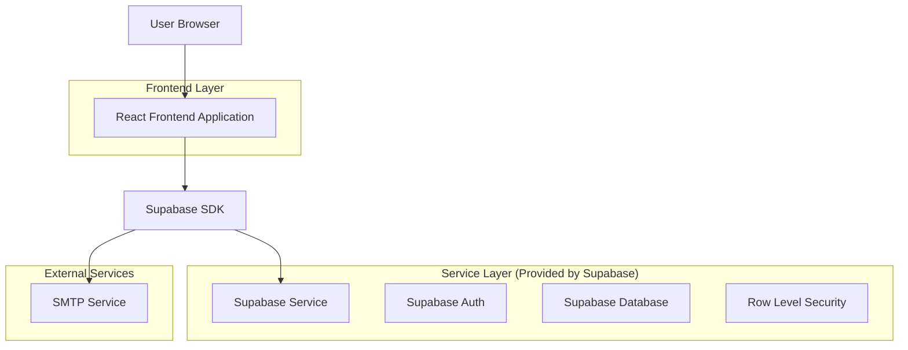
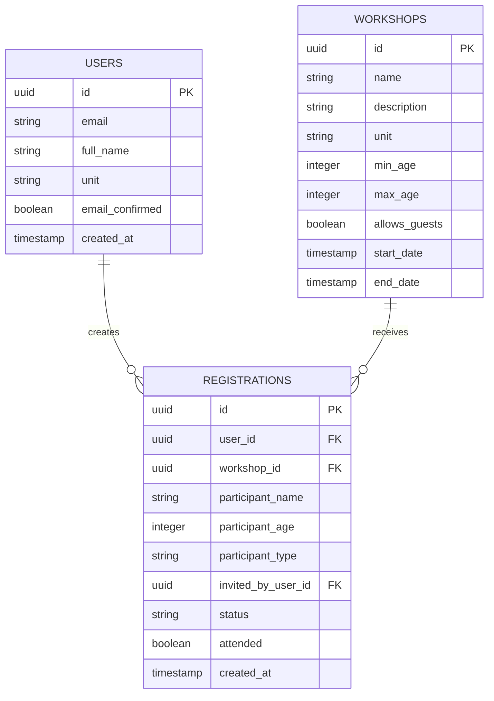

## 1. Architecture Design



## 2. Technology Description

* Frontend: React\@18 + TypeScript + Tailwind CSS + Vite

* Backend: Supabase (Auth + Database + RLS)

* Email: SMTP personalizado (chave: vwzjymqvyubsmclj)

* Deployment: Vercel

## 3. Route Definitions

| Route            | Purpose                                                   |
| ---------------- | --------------------------------------------------------- |
| /cadastro        | Página de cadastro de usuários com seleção de unidade     |
| /login           | Página de login e recuperação de senha                    |
| /confirmar-email | Página de confirmação de email                            |
| /dashboard       | Dashboard do usuário com oficinas filtradas               |
| /inscricoes      | Formulário de inscrição com opção de adicionar convidados |
| /admin           | Painel administrativo com filtros por unidade             |
| /admin/oficinas  | Formulário de criação/edição de oficinas                  |
| /admin/presenca  | Controle de presença de usuários e convidados             |

## 4. API Definitions

### 4.1 Core API

**Autenticação de usuários**

```
POST /auth/signup
```

Request:

| Param Name | Param Type | isRequired | Description                             |
| ---------- | ---------- | ---------- | --------------------------------------- |
| email      | string     | true       | Email do usuário                        |
| password   | string     | true       | Senha do usuário                        |
| full\_name | string     | true       | Nome completo                           |
| unit       | string     | true       | Unidade (campo\_grande, barra, recreio) |

Response:

| Param Name | Param Type | Description             |
| ---------- | ---------- | ----------------------- |
| user       | object     | Dados do usuário criado |
| session    | object     | Sessão de autenticação  |

**Recuperação de senha**

```
POST /auth/reset-password
```

Request:

| Param Name | Param Type | isRequired | Description            |
| ---------- | ---------- | ---------- | ---------------------- |
| email      | string     | true       | Email para recuperação |

Response:

| Param Name | Param Type | Description          |
| ---------- | ---------- | -------------------- |
| message    | string     | Confirmação de envio |

**Filtrar oficinas por unidade**

```
GET /workshops/by-unit
```

Request:

| Param Name | Param Type | isRequired | Description        |
| ---------- | ---------- | ---------- | ------------------ |
| unit       | string     | true       | Unidade do usuário |

Response:

| Param Name | Param Type | Description                  |
| ---------- | ---------- | ---------------------------- |
| workshops  | array      | Lista de oficinas da unidade |

**Inscrição com convidados**

```
POST /registrations
```

Request:

| Param Name   | Param Type | isRequired | Description                                |
| ------------ | ---------- | ---------- | ------------------------------------------ |
| workshop\_id | uuid       | true       | ID da oficina                              |
| guests       | array      | false      | Lista de convidados (nome, idade, oficina) |

Response:

| Param Name   | Param Type | Description                     |
| ------------ | ---------- | ------------------------------- |
| registration | object     | Dados da inscrição criada       |
| guests       | array      | Lista de convidados registrados |

## 5. Data Model

### 5.1 Data Model Definition



### 5.2 Data Definition Language

**Tabela de Usuários Estendida**

```sql
-- Adicionar campos à tabela users existente
ALTER TABLE users ADD COLUMN IF NOT EXISTS unit VARCHAR(20) CHECK (unit IN ('campo_grande', 'barra', 'recreio'));
ALTER TABLE users ADD COLUMN IF NOT EXISTS email_confirmed BOOLEAN DEFAULT FALSE;
ALTER TABLE users ADD COLUMN IF NOT EXISTS full_name VARCHAR(255);

-- Índices para performance
CREATE INDEX IF NOT EXISTS idx_users_unit ON users(unit);
CREATE INDEX IF NOT EXISTS idx_users_email_confirmed ON users(email_confirmed);
```

**Tabela de Oficinas Estendida**

```sql
-- Adicionar campos à tabela workshops existente
ALTER TABLE workshops ADD COLUMN IF NOT EXISTS unit VARCHAR(20) CHECK (unit IN ('campo_grande', 'barra', 'recreio', 'todas'));
ALTER TABLE workshops ADD COLUMN IF NOT EXISTS min_age INTEGER;
ALTER TABLE workshops ADD COLUMN IF NOT EXISTS max_age INTEGER;
ALTER TABLE workshops ADD COLUMN IF NOT EXISTS allows_guests BOOLEAN DEFAULT FALSE;

-- Índices para performance
CREATE INDEX IF NOT EXISTS idx_workshops_unit ON workshops(unit);
CREATE INDEX IF NOT EXISTS idx_workshops_allows_guests ON workshops(allows_guests);
```

**Atualizar Tabela de Inscrições para Incluir Convidados**

```sql
-- Adicionar campos para suportar convidados na tabela de inscrições
ALTER TABLE inscricoes ADD COLUMN IF NOT EXISTS participant_name VARCHAR(255);
ALTER TABLE inscricoes ADD COLUMN IF NOT EXISTS participant_age INTEGER;
ALTER TABLE inscricoes ADD COLUMN IF NOT EXISTS participant_type VARCHAR(20) DEFAULT 'user' CHECK (participant_type IN ('user', 'guest'));
ALTER TABLE inscricoes ADD COLUMN IF NOT EXISTS invited_by_user_id UUID REFERENCES users(id) ON DELETE CASCADE;

-- Índices para performance
CREATE INDEX IF NOT EXISTS idx_inscricoes_participant_type ON inscricoes(participant_type);
CREATE INDEX IF NOT EXISTS idx_inscricoes_invited_by_user_id ON inscricoes(invited_by_user_id);
```

**Políticas RLS (Row Level Security)**

```sql
-- Política para usuários verem apenas oficinas de sua unidade
CREATE POLICY "Users can view workshops from their unit" ON workshops
  FOR SELECT USING (
    unit = 'todas' OR 
    unit = (SELECT unit FROM users WHERE users.user_id = auth.uid())
  );

-- Política para usuários gerenciarem apenas suas inscrições e convidados
CREATE POLICY "Users can manage their own registrations and guests" ON inscricoes
  FOR ALL USING (
    user_id = (SELECT id FROM users WHERE user_id = auth.uid()) OR
    invited_by_user_id = (SELECT id FROM users WHERE user_id = auth.uid())
  );

-- Política para admins verem tudo
CREATE POLICY "Admins can view all data" ON workshops
  FOR ALL USING (
    EXISTS (
      SELECT 1 FROM users 
      WHERE user_id = auth.uid() 
      AND user_type = 'admin'
    )
  );
```

**Funções para Email**

```sql
-- Função para envio de email de confirmação
CREATE OR REPLACE FUNCTION send_confirmation_email(user_email TEXT, confirmation_token TEXT)
RETURNS VOID AS $$
BEGIN
  -- Implementar integração com SMTP usando a chave vwzjymqvyubsmclj
  -- Esta função será implementada via Edge Function
  PERFORM pg_notify('email_confirmation', json_build_object(
    'email', user_email,
    'token', confirmation_token,
    'type', 'confirmation'
  )::text);
END;
$$ LANGUAGE plpgsql;

-- Função para envio de email de recuperação
CREATE OR REPLACE FUNCTION send_password_reset_email(user_email TEXT, reset_token TEXT)
RETURNS VOID AS $$
BEGIN
  PERFORM pg_notify('password_reset', json_build_object(
    'email', user_email,
    'token', reset_token,
    'type', 'password_reset'
  )::text);
END;
$$ LANGUAGE plpgsql;
```

**Dados Iniciais**

```sql
-- Inserir oficinas de exemplo
INSERT INTO workshops (name, description, unit, allows_guests, min_age, max_age)
VALUES 
  ('Oficina Teste Campo Grande', 'Oficina de teste para Campo Grande', 'campo_grande', true, 16, 65),
  ('Oficina Teste Barra', 'Oficina de teste para Barra', 'barra', false, 18, 60),
  ('Oficina Teste Recreio', 'Oficina de teste para Recreio', 'recreio', true, 14, 70)
ON CONFLICT DO NOTHING;

-- Exemplo de inscrição com convidado
-- INSERT INTO inscricoes (user_id, workshop_id, participant_name, participant_age, participant_type, invited_by_user_id)
-- VALUES 
--   (user_uuid, workshop_uuid, 'João Silva', 25, 'user', NULL),
--   (NULL, workshop_uuid, 'Maria Santos', 22, 'guest', user_uuid);
```

