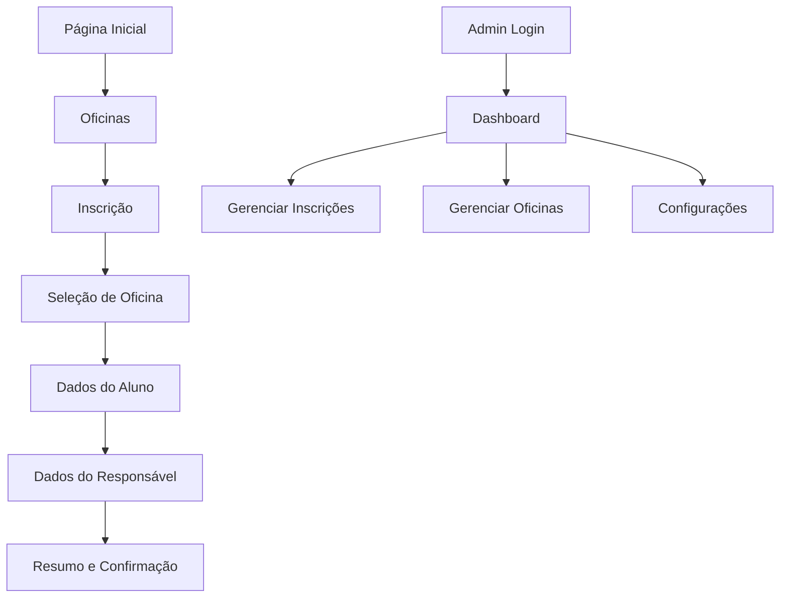

# La Music Week - Documento de Requisitos do Produto

## 1. Visão Geral do Produto

O "La Music Week" é uma plataforma web moderna para gerenciar inscrições e organização de eventos musicais. A aplicação atende participantes que se inscrevem em oficinas e administradores que gerenciam o evento através de um painel de controle avançado.

O sistema utiliza tecnologias cutting-edge com Next.js, TypeScript, Tailwind CSS, shadcn/ui e Supabase, proporcionando uma experiência visual impressionante com glassmorphism, gradientes e SVGs animados.

## 2. Funcionalidades Principais

### 2.1 Papéis de Usuário

| Papel | Método de Acesso | Permissões Principais |
|-------|------------------|----------------------|
| Participante/Responsável | Acesso público | Visualizar oficinas, realizar inscrições, acompanhar status |
| Administrador | Login seguro | Gerenciar inscrições, oficinas, estatísticas e comunicação |

### 2.2 Módulos de Funcionalidades

Nossa plataforma La Music Week consiste nas seguintes páginas principais:

1. **Página Inicial**: hero section com gradientes, seção de recursos, prévia de oficinas, contato
2. **Página de Oficinas**: listagem completa com cards glassmorphism, filtros avançados
3. **Fluxo de Inscrição**: formulário multi-etapas com animações suaves e validação em tempo real
4. **Login Administrativo**: autenticação segura com design moderno
5. **Dashboard Admin**: estatísticas visuais, gráficos interativos, acesso rápido
6. **Gerenciamento**: interface CRUD para inscrições e oficinas com modais elegantes
7. **Configurações**: painel de controle do sistema com toggles e ajustes visuais

### 2.3 Detalhes das Páginas

| Nome da Página | Módulo | Descrição da Funcionalidade |
|----------------|--------|-----------------------------|
| Página Inicial | Hero Section | Apresentação principal com gradientes animados, call-to-action destacado |
| Página Inicial | Features Section | Cards com glassmorphism mostrando benefícios do evento |
| Página Inicial | Workshops Preview | Grid responsivo com prévia das oficinas disponíveis |
| Página Inicial | Contact Section | Informações de contato com ícones SVG animados |
| Oficinas | Lista de Oficinas | Cards com efeito hover, filtros por categoria, busca em tempo real |
| Inscrição | Seleção de Oficina | Interface multi-seleção com checkboxes customizados |
| Inscrição | Formulário do Aluno | Campos com validação visual, máscaras de entrada |
| Inscrição | Formulário do Responsável | Coleta de dados do guardião com design consistente |
| Inscrição | Resumo da Inscrição | Tela de confirmação com animações de sucesso |
| Admin Login | Autenticação | Login seguro com design glassmorphism |
| Dashboard Admin | Estatísticas | Gráficos interativos, métricas em tempo real |
| Dashboard Admin | Navegação Rápida | Menu lateral com ícones SVG e transições suaves |
| Gerenciamento | Tabela de Inscrições | DataTable com filtros, paginação, exportação |
| Gerenciamento | Detalhes da Inscrição | Modal com informações completas e ações |
| Gerenciamento | CRUD Oficinas | Interface para criar, editar e remover oficinas |
| Configurações | Painel de Controle | Ajustes do sistema com toggles e sliders modernos |

## 3. Fluxo Principal

**Fluxo do Participante:**
O usuário acessa a página inicial, explora as oficinas disponíveis, inicia o processo de inscrição selecionando oficinas, preenche dados pessoais e do responsável, revisa as informações e confirma a inscrição.

**Fluxo do Administrador:**
O administrador faz login no painel, visualiza estatísticas no dashboard, gerencia inscrições e oficinas através de interfaces CRUD, utiliza ferramentas de comunicação e ajusta configurações do sistema.

## 4. Design da Interface

### 4.1 Estilo de Design

- **Cores Primárias**: Gradientes vibrantes (#6366f1 → #8b5cf6, #ec4899 → #f59e0b)
- **Cores Secundárias**: Tons neutros com glassmorphism (rgba(255,255,255,0.1))
- **Estilo de Botões**: Glassmorphism com bordas suaves, efeitos hover com transformações
- **Tipografia**: Inter (títulos), Source Sans Pro (corpo), tamanhos responsivos
- **Layout**: Design card-based com espaçamento generoso, navegação top fixa
- **Ícones**: SVGs customizados com animações micro-interativas, Lucide React

### 4.2 Visão Geral do Design das Páginas

| Nome da Página | Módulo | Elementos de UI |
|----------------|--------|----------------|
| Página Inicial | Hero Section | Gradiente de fundo animado, texto com efeito glow, botão CTA com glassmorphism |
| Página Inicial | Features Section | Cards flutuantes com backdrop-blur, ícones SVG animados |
| Oficinas | Lista | Grid responsivo, cards com hover effects, filtros com design moderno |
| Inscrição | Formulário | Steps indicator, campos com focus states, validação visual |
| Dashboard Admin | Estatísticas | Gráficos com gradientes, cards com sombras suaves, layout em grid |
| Gerenciamento | Tabelas | DataTable com design moderno, modais com glassmorphism |

### 4.3 Responsividade

A aplicação é mobile-first com design adaptativo, otimizada para touch em dispositivos móveis e com transições suaves entre breakpoints. Utiliza CSS Grid e Flexbox para layouts fluidos.