# Arquitetura Técnica PWA - LA Music Week

## 1. Arquitetura Geral do PWA

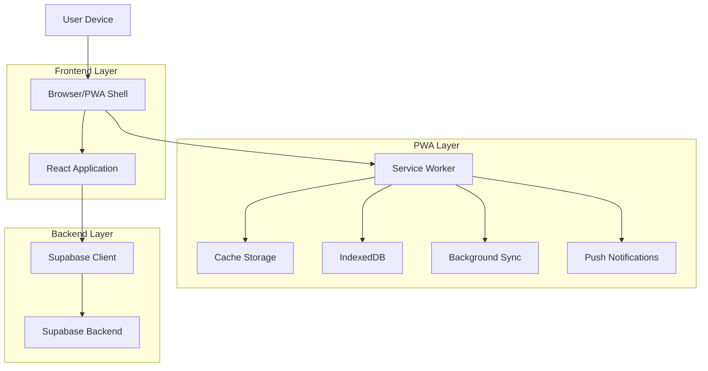

## 2. Tecnologias e Dependências

### 2.1 Core PWA
- **Frontend**: React@18 + TypeScript + Vite
- **PWA Plugin**: vite-plugin-pwa@0.17.0
- **Service Worker**: Workbox@7.0.0
- **Styling**: TailwindCSS@3 + CSS Custom Properties
- **Icons**: Lucide React + Custom PWA Icons

### 2.2 PWA Específicas
- **Manifest**: Web App Manifest v3
- **Cache Strategy**: Workbox Runtime Caching
- **Offline Storage**: IndexedDB + Cache API
- **Install Prompt**: BeforeInstallPrompt API
- **Updates**: Service Worker Update Flow

### 2.3 Mobile Optimization
- **Responsive Design**: Mobile-first approach
- **Touch Optimization**: 44px minimum touch targets
- **Safe Areas**: CSS env() variables
- **Performance**: Lazy loading + Code splitting

## 3. Estrutura de Arquivos PWA

```
src/
├── components/
│   ├── InstallPrompt.tsx
│   ├── UpdatePrompt.tsx
│   ├── OptimizedImage.tsx
│   └── PWALayout.tsx
├── hooks/
│   ├── usePWA.ts
│   ├── useOffline.ts
│   └── useInstallPrompt.ts
├── utils/
│   ├── pwaConfig.ts
│   ├── iosConfig.ts
│   ├── androidConfig.ts
│   └── analytics.ts
├── styles/
│   ├── pwa.css
│   └── mobile.css
public/
├── manifest.json
├── sw.js (gerado pelo Vite PWA)
├── icons/
│   ├── icon-72x72.png
│   ├── icon-96x96.png
│   ├── icon-128x128.png
│   ├── icon-144x144.png
│   ├── icon-152x152.png
│   ├── icon-192x192.png
│   ├── icon-384x384.png
│   └── icon-512x512.png
└── screenshots/
    ├── mobile-home.png
    └── desktop-home.png
```

## 4. Service Worker Architecture

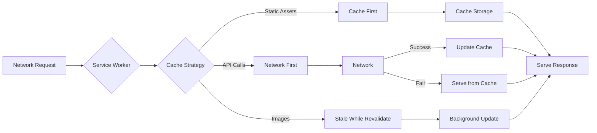

### 4.1 Cache Strategies

| Resource Type | Strategy | Cache Name | TTL |
|---------------|----------|------------|-----|
| Static Assets (JS/CSS) | Cache First | static-cache | 1 year |
| HTML Pages | Network First | pages-cache | 1 day |
| API Responses | Network First | api-cache | 5 minutes |
| Images | Stale While Revalidate | images-cache | 30 days |
| Fonts | Cache First | fonts-cache | 1 year |

### 4.2 Offline Functionality

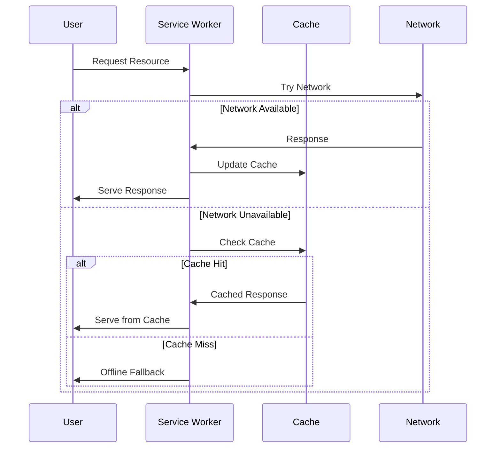

## 5. Install Flow Architecture

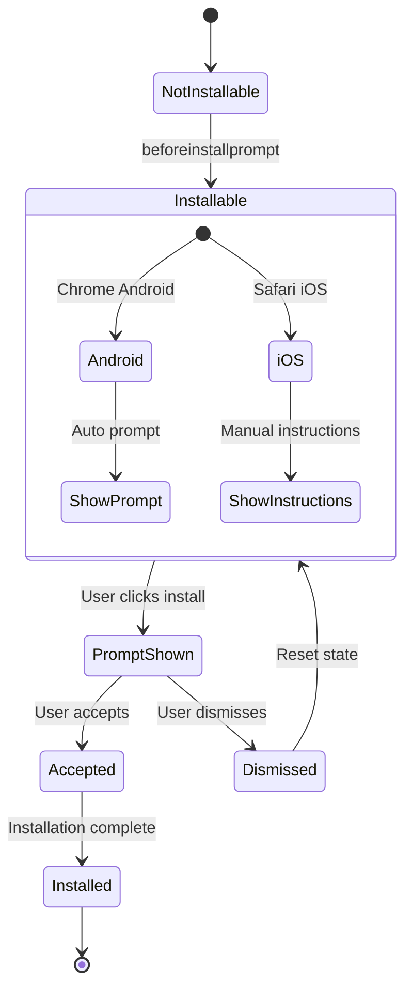

### 5.1 Platform-Specific Install

| Platform | Method | Trigger | UX Pattern |
|----------|--------|---------|------------|
| Chrome Android | beforeinstallprompt | Automatic | Bottom banner + button |
| Safari iOS | Manual | User action | Instructions modal |
| Edge Windows | beforeinstallprompt | Automatic | Address bar + banner |
| Chrome Desktop | beforeinstallprompt | Automatic | Address bar icon |

## 6. Responsive Design System

### 6.1 Breakpoints

```css
/* Mobile First Approach */
.container {
  /* Base: Mobile (320px+) */
  padding: 1rem;
}

@media (min-width: 475px) {
  /* Extra Small */
  .container { padding: 1.5rem; }
}

@media (min-width: 640px) {
  /* Small */
  .container { padding: 2rem; }
}

@media (min-width: 768px) {
  /* Medium */
  .container { padding: 2.5rem; }
}

@media (min-width: 1024px) {
  /* Large */
  .container { padding: 3rem; }
}
```

### 6.2 Touch Targets

```css
/* Minimum 44px touch targets */
.touch-target {
  min-height: 44px;
  min-width: 44px;
  padding: 12px;
  margin: 4px;
}

/* Safe area support */
.safe-area {
  padding-top: env(safe-area-inset-top);
  padding-bottom: env(safe-area-inset-bottom);
  padding-left: env(safe-area-inset-left);
  padding-right: env(safe-area-inset-right);
}
```

## 7. Performance Optimization

### 7.1 Code Splitting Strategy

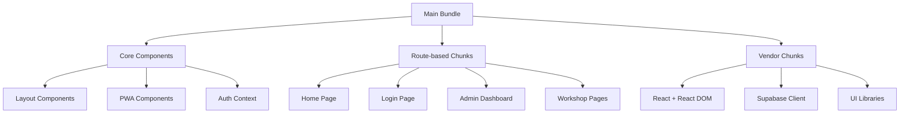

### 7.2 Loading Strategies

| Resource | Strategy | Priority | Implementation |
|----------|----------|----------|----------------|
| Critical CSS | Inline | High | Vite CSS inlining |
| Hero Images | Preload | High | `<link rel="preload">` |
| Route Components | Lazy Load | Medium | React.lazy() |
| Non-critical JS | Defer | Low | Dynamic imports |
| Images | Lazy Load | Low | Intersection Observer |

### 7.3 Bundle Analysis

```bash
# Analyze bundle size
npx vite-bundle-analyzer

# Performance audit
npx lighthouse http://localhost:4173 --view

# PWA audit
npx lighthouse http://localhost:4173 --only-categories=pwa --view
```

## 8. Offline Data Management

### 8.1 Data Sync Architecture

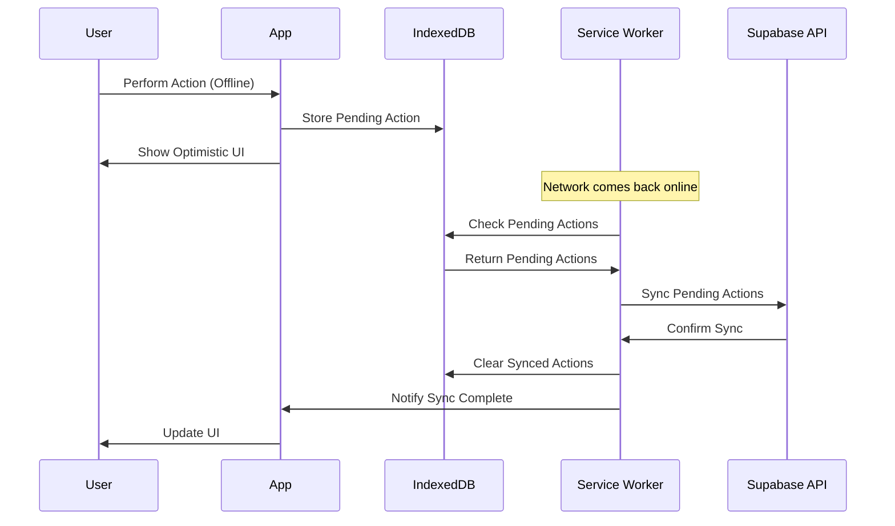

### 8.2 Storage Strategy

| Data Type | Storage | Sync Strategy | Retention |
|-----------|---------|---------------|----------|
| User Profile | IndexedDB | Background Sync | Persistent |
| Workshop Data | Cache API | Stale While Revalidate | 7 days |
| Form Drafts | LocalStorage | Manual Sync | 30 days |
| Images | Cache API | Cache First | 30 days |
| API Responses | Cache API | Network First | 1 hour |

## 9. Security Considerations

### 9.1 PWA Security Model

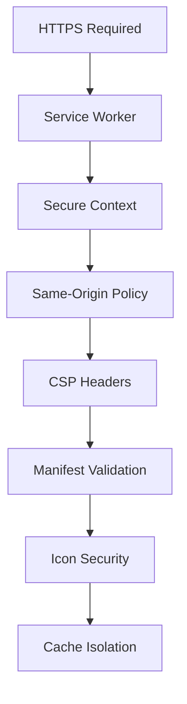

### 9.2 Security Headers

```javascript
// vercel.json security headers
{
  "headers": [
    {
      "source": "/(.*)",
      "headers": [
        {
          "key": "Content-Security-Policy",
          "value": "default-src 'self'; script-src 'self' 'unsafe-inline'; style-src 'self' 'unsafe-inline'; img-src 'self' data: https:; connect-src 'self' https://*.supabase.co;"
        },
        {
          "key": "X-Frame-Options",
          "value": "DENY"
        },
        {
          "key": "X-Content-Type-Options",
          "value": "nosniff"
        }
      ]
    }
  ]
}
```

## 10. Testing Strategy

### 10.1 PWA Testing Pyramid

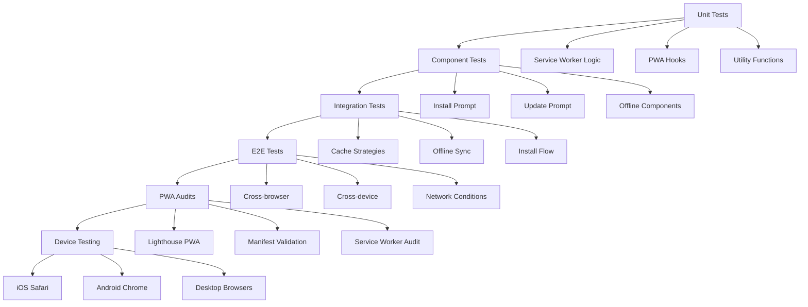

### 10.2 Test Commands

```bash
# Unit tests
npm run test

# PWA audit
npm run test:pwa

# Cross-browser testing
npm run test:browsers

# Performance testing
npm run test:performance

# Accessibility testing
npm run test:a11y
```

## 11. Deployment Pipeline

### 11.1 Build Process

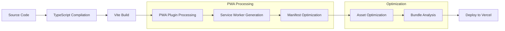

### 11.2 Environment Configuration

| Environment | PWA Features | Service Worker | Analytics |
|-------------|--------------|----------------|----------|
| Development | Enabled | Dev mode | Disabled |
| Staging | Enabled | Production | Test mode |
| Production | Enabled | Production | Enabled |

## 12. Monitoring and Analytics

### 12.1 PWA Metrics

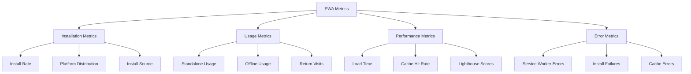

### 12.2 Key Performance Indicators

| Metric | Target | Measurement |
|--------|--------|--------------|
| Install Rate | >15% | Installs / Unique Visitors |
| Lighthouse PWA Score | >90 | Automated audits |
| Offline Usage | >5% | Offline page views |
| Cache Hit Rate | >80% | Service Worker analytics |
| Load Time (3G) | <3s | Real User Monitoring |

## 13. Maintenance and Updates

### 13.1 Update Strategy

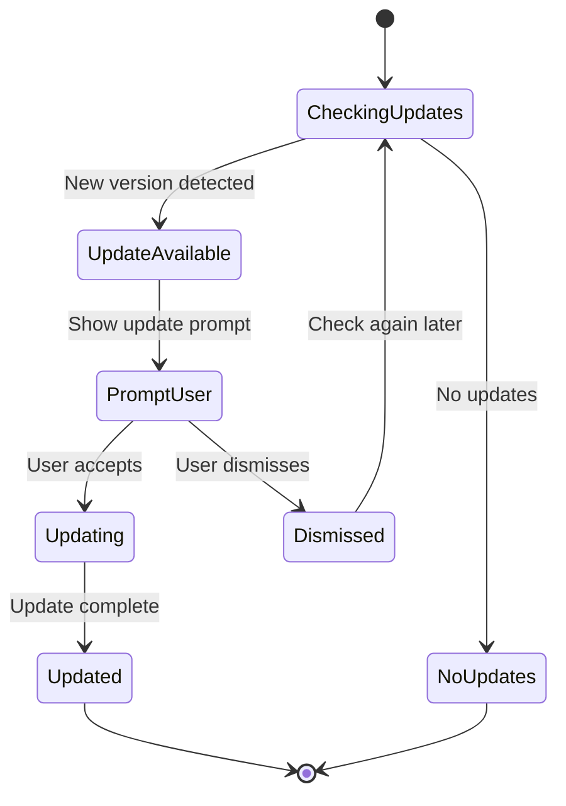

### 13.2 Version Management

```javascript
// Version tracking in manifest.json
{
  "name": "LA Music Week",
  "version": "1.0.0",
  "version_name": "Initial PWA Release",
  "background_color": "#1a1a2e",
  "theme_color": "#16213e"
}
```

## 14. Browser Compatibility

### 14.1 PWA Feature Support

| Feature | Chrome | Safari | Firefox | Edge |
|---------|--------|--------|---------|------|
| Service Workers | ✅ | ✅ | ✅ | ✅ |
| Web App Manifest | ✅ | ✅ | ✅ | ✅ |
| Install Prompt | ✅ | ❌ | ❌ | ✅ |
| Background Sync | ✅ | ❌ | ❌ | ✅ |
| Push Notifications | ✅ | ✅ | ✅ | ✅ |
| Offline Support | ✅ | ✅ | ✅ | ✅ |

### 14.2 Fallback Strategies

```javascript
// Progressive enhancement approach
if ('serviceWorker' in navigator) {
  // Full PWA features
  registerServiceWorker()
} else {
  // Graceful degradation
  console.warn('Service Workers not supported')
}

if ('BeforeInstallPromptEvent' in window) {
  // Native install prompt
  setupInstallPrompt()
} else {
  // Manual install instructions
  showManualInstallGuide()
}
```

## 15. Conclusão Técnica

Esta arquitetura PWA fornece:

✅ **Arquitetura robusta** com Service Workers e cache inteligente
✅ **Compatibilidade multiplataforma** com fallbacks apropriados
✅ **Performance otimizada** com code splitting e lazy loading
✅ **Experiência offline** com sincronização de dados
✅ **Instalação nativa** com prompts personalizados
✅ **Monitoramento completo** com métricas e analytics
✅ **Segurança adequada** com headers e políticas CSP
✅ **Manutenibilidade** com estratégias de update e versionamento

A implementação seguindo esta arquitetura resultará em um PWA de alta qualidade, performático e compatível com todos os principais navegadores e dispositivos móveis.