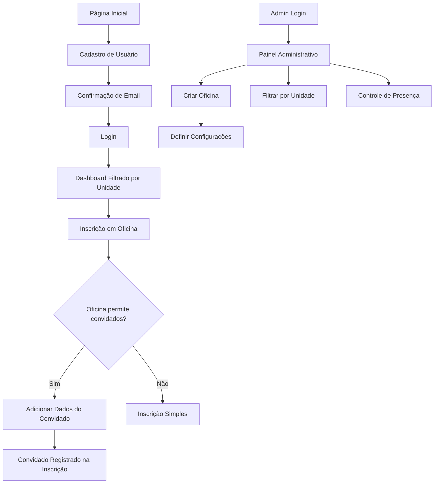

## 1. Product Overview
Sistema de autenticação e gestão de usuários para plataforma de oficinas musicais com filtros por unidade geográfica e sistema avançado de convidados.

O sistema permitirá que usuários se cadastrem selecionando sua unidade (Campo Grande, Barra, Recreio), recebam confirmação por email e tenham acesso apenas às oficinas de sua região. Inclui funcionalidades para convidados dinâmicos e controle de presença.

## 2. Core Features

### 2.1 User Roles
| Role | Registration Method | Core Permissions |
|------|---------------------|------------------|
| Usuário Regular | Cadastro com email e seleção de unidade | Visualizar e se inscrever em oficinas da sua unidade, adicionar convidados |
| Administrador | Login com credenciais específicas | Gerenciar oficinas, usuários e relatórios |

### 2.2 Feature Module
Nosso sistema de autenticação consiste nas seguintes páginas principais:
1. **Página de Cadastro**: seleção de unidade, confirmação de email, validação de dados.
2. **Página de Login**: autenticação de usuários, recuperação de senha.
3. **Dashboard do Usuário**: oficinas filtradas por unidade, histórico de inscrições.
4. **Formulário de Inscrição**: inscrição em oficinas com opção de adicionar convidados.
5. **Painel Administrativo**: filtros por unidade, controle de presença, gestão de inscrições.

### 2.3 Page Details
| Page Name | Module Name | Feature description |
|-----------|-------------|---------------------|
| Página de Cadastro | Formulário de Registro | Coletar dados pessoais, seleção de unidade (Campo Grande/Barra/Recreio), envio de email de confirmação |
| Página de Cadastro | Validação de Email | Confirmar email através de link enviado via SMTP, ativar conta do usuário |
| Página de Login | Autenticação | Login com email/senha, opção de recuperação de senha via email |
| Página de Login | Recuperação de Senha | Envio de link de reset via SMTP, formulário de nova senha |
| Dashboard do Usuário | Filtro de Oficinas | Exibir apenas oficinas da unidade do usuário logado |
| Dashboard do Usuário | Histórico de Inscrições | Listar inscrições ativas e passadas do usuário |
| Formulário de Inscrição | Adição de Convidados | Campos dinâmicos para adicionar convidados (nome, idade, oficina) durante a inscrição |
| Tabela de Inscrições | Visualização de Convidados | Exibir convidados junto com inscrições, indicando o usuário responsável |
| Formulário de Oficina | Configuração de Convidados | Campo dinâmico para permitir/não permitir convidados por oficina |
| Formulário de Oficina | Idade Mínima/Máxima | Campos para definir faixa etária permitida na oficina |
| Formulário de Oficina | Seleção de Unidade | Dropdown para escolher unidade da oficina (Campo Grande/Barra/Recreio/Todas) |
| Painel Administrativo | Filtro por Unidade | Filtrar dashboard administrativo por unidade específica |
| Painel Administrativo | Controle de Presença | Marcar presença de usuários e convidados nos eventos |
| Painel Administrativo | Gestão de Inscrições | Visualizar todas as inscrições incluindo convidados e seus responsáveis |

## 3. Core Process

**Fluxo do Usuário Regular:**
1. Usuário acessa página de cadastro
2. Preenche dados pessoais e seleciona unidade
3. Recebe email de confirmação via SMTP
4. Confirma email e ativa conta
5. Faz login e visualiza apenas oficinas de sua unidade
6. Ao se inscrever em oficina, pode adicionar convidados (nome, idade, oficina escolhida)
7. Convidados aparecem na tabela de inscrições vinculados ao usuário responsável

**Fluxo do Administrador:**
1. Admin faz login no painel administrativo
2. Cria oficinas definindo unidade, idade mín/máx e se permite convidados
3. Filtra dashboard por unidade para visualizar dados específicos
4. Controla presença de usuários e convidados nos eventos
5. Monitora relação entre usuários principais e convidados

## 4. User Interface Design

### 4.1 Design Style
- **Cores Primárias:** #1a365d (azul escuro), #2d3748 (cinza escuro)
- **Cores Secundárias:** #4299e1 (azul claro), #68d391 (verde)
- **Estilo de Botões:** Arredondados com sombra sutil
- **Fonte:** Inter, tamanhos 14px (corpo), 18px (títulos), 24px (cabeçalhos)
- **Layout:** Card-based com navegação superior fixa
- **Ícones:** Lucide React com estilo minimalista

### 4.2 Page Design Overview
| Page Name | Module Name | UI Elements |
|-----------|-------------|-------------|
| Página de Cadastro | Formulário de Registro | Card centralizado, campos com validação visual, dropdown estilizado para unidades, botão de confirmação destacado |
| Página de Login | Autenticação | Layout minimalista, campos de entrada com ícones, link de recuperação discreto |
| Dashboard do Usuário | Filtro de Oficinas | Grid de cards para oficinas, badge indicando unidade, filtros laterais |
| Formulário de Inscrição | Adição de Convidados | Seção expansível no formulário, campos dinâmicos para múltiplos convidados, validação de idade |
| Painel Administrativo | Controle de Presença | Tabela responsiva, checkboxes para presença, indicadores visuais de status |

### 4.3 Responsiveness
O sistema é mobile-first com adaptação para desktop. Inclui otimização para touch em dispositivos móveis, com botões e campos de tamanho adequado para interação táctil.